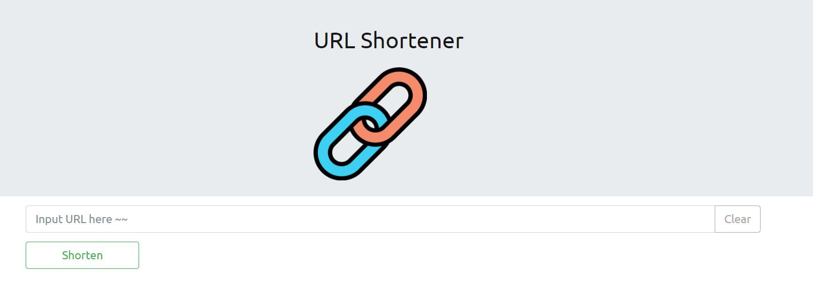

# Short-URL

此專案由伺服器產生一組短的網址，以代替原來可能較長的網址，並讓使用者可以在其他地方任意使用

## Getting Started
1. 將專案 clone 到本機
```bash
git clone https://github.com/GallonShih/Short-URL.git
```
2. 請確認本機是否已安裝MongoDB，並運行中
3. 透過 npm 安裝相關套件
```bash
npm install
```
4. 安裝完畢後，啟動 server
```bash
nodemon app.js
```
5. 等待終端機出現
```bash
App is running on http://localhost:3000
```
6. 於網址輸入 localhost:3000
7. 若要暫停使用
```bash
ctrl + c
```

## Authors

* **Gallon Shih** 

## Development Tools

* Node.js 14.16.0
* Express 4.17.2
* Express-Handlebars 3.0.0
* body-parser 1.19.1
* mongoose 6.1.7
